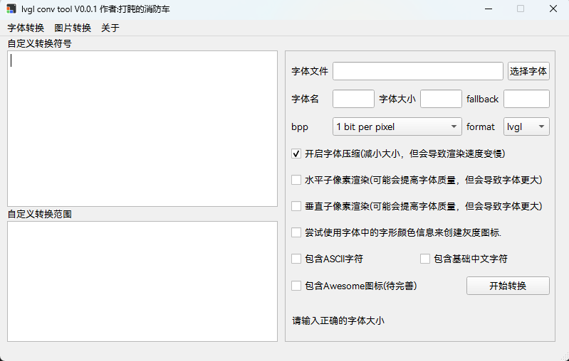

**English** | [中文](./README_zh.md) 

# lvgl_conv_tool

github: [Dozingfiretruck/lvgl_conv_tool: LVGL converter tool](https://github.com/Dozingfiretruck/lvgl_conv_tool)

gitee: [lvgl_conv_tool: lvgl 转换工具](https://gitee.com/Dozingfiretruck/lvgl_conv_tool)

#### Description

​	LVGL conversion tool, support font conversion, and support image conversion in the future

#### Software Architecture
​	The tool is written in pyside6 (QT for python).

#### Installation

​	No need to install a double click to run
